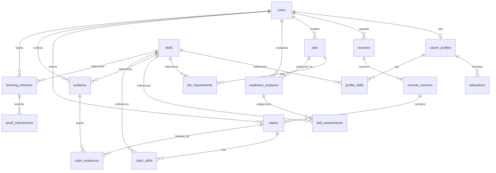

# Implementation Plan - Job Readiness Copilot Backend

We will build a truth-first AI-powered **Job Readiness Copilot** as a **Modular Monolith** using **Java 21, Spring Boot 3.x, PostgreSQL, and Flyway**. 

This plan designs the package architecture, database relations, API endpoints, module responsibilities, and our phased execution path.

---

## User Review Required

> [!IMPORTANT]
> **Aesthetic & Structural Design Choices**
> 1. **Modular Monolith Boundaries**: All modules are packaged by feature. They will use service-to-service calls inside the monolith, but we will minimize circular dependencies to keep them clean for future microservices extraction.
> 2. **AI Provider Abstraction**: An interface-driven AI layer (`AIService`) will isolate all LLM operations. The initial implementation will use the Gemini API (via HTTP client/Spring AI/official SDK).
> 3. **Raw Text Extraction vs AI Parsing**: Resume files (.pdf, .docx) will first have their raw text extracted using Apache PDFBox and Apache POI. We then feed this structured raw text into the AI parser, saving on AI processing load and avoiding file-reading bugs in the LLM.

---

## Open Questions

> [!NOTE]
> **Security & Deployment**
> 1. Do you have a preferred Spring Boot version (e.g., 3.2.x or 3.3.x)? I will default to 3.3.x.
> 2. Should we implement file upload storage locally inside a volume-mounted directory (e.g., `./uploads/`) for the MVP docker setup, or do you have an S3-compatible service (like MinIO) in mind for local dev? I will default to local directory storage with a clean `FileStorageService` abstraction interface so we can swap it later.

---

## Entity Relationship Plan (Database Schema)

We will use Flyway for managing migrations. The relations are structured as follows to enforce:
`Skill` ➔ `Evidence` ➔ `Approved Claim` ➔ `Resume Version` ➔ `Job`

### Table Definitions & Keys

1. **`users`**: Account identity.
   - Fields: `id` (UUID), `email` (VARCHAR, Unique), `password_hash` (VARCHAR), `status` (VARCHAR), `created_at`, `updated_at`.
2. **`career_profiles`**: Master Career Profile.
   - Fields: `id` (UUID), `user_id` (UUID, FK, Unique), `first_name` (VARCHAR), `last_name` (VARCHAR), `target_roles` (TEXT/JSON), `github_url`, `linkedin_url`, `portfolio_url`, `summary` (TEXT), `created_at`, `updated_at`.
3. **`educations`**: Education history.
   - Fields: `id` (UUID), `profile_id` (UUID, FK), `school` (VARCHAR), `degree` (VARCHAR), `field_of_study` (VARCHAR), `start_date`, `end_date`, `gpa` (NUMERIC).
4. **`skills`**: Master Skill registry (Canonical identities).
   - Fields: `id` (UUID), `name` (VARCHAR, Unique, e.g., "Java", "Docker"), `category` (VARCHAR).
5. **`profile_skills`**: Skills owned by user.
   - Fields: `profile_id` (UUID, FK), `skill_id` (UUID, FK), `self_assessed_level` (VARCHAR). Primary key is `(profile_id, skill_id)`.
6. **`projects` / `experiences` / `certifications`**: Profile details.
   - Mapped to `career_profiles.id` (FK).
7. **`resumes`**: The uploaded master resume files.
   - Fields: `id` (UUID), `user_id` (UUID, FK), `filename`, `file_path`, `file_type`, `raw_text` (TEXT), `created_at`.
8. **`resume_versions`**: Generated resumes (job-specific or revisions).
   - Fields: `id` (UUID), `resume_id` (UUID, FK), `user_id` (UUID, FK), `job_id` (UUID, FK, Nullable), `version_number` (INT), `file_path`, `content_json` (TEXT/JSON), `is_tailored` (BOOLEAN).
9. **`jobs`**: Target jobs.
   - Fields: `id` (UUID), `user_id` (UUID, FK), `title`, `company`, `description` (TEXT), `raw_jd_text` (TEXT), `created_at`.
10. **`job_requirements`**: Structured requirements parsed from JD.
    - Fields: `id` (UUID), `job_id` (UUID, FK), `type` (MUST_HAVE, PREFERRED, SOFT_SKILL, RESPONSIBILITY, etc.), `description` (TEXT), `skill_id` (UUID, FK, Nullable).
11. **`readiness_analyses`**: Copilot analysis header.
    - Fields: `id` (UUID), `user_id` (UUID, FK), `job_id` (UUID, FK), `eligibility_summary` (TEXT), `technical_fit_summary` (TEXT), `evidence_strength_summary` (TEXT), `presentation_summary` (TEXT), `recommendation` (VARCHAR: APPLY_NOW, etc.), `created_at`.
12. **`skill_assessments`**: The Four-Bucket Skill analysis lines.
    - Fields: `id` (UUID), `readiness_analysis_id` (UUID, FK), `skill_id` (UUID, FK), `classification` (VARCHAR: DEMONSTRATED, HIDDEN_BUT_LIKELY, CONFIRMED_BUT_WEAK, GENUINE_GAP), `details` (TEXT).
13. **`evidence`**: Evidence collected for skills.
    - Fields: `id` (UUID), `user_id` (UUID, FK), `skill_id` (UUID, FK), `title` (VARCHAR), `description` (TEXT), `evidence_type` (VARCHAR: PROJECT, EXPERIENCE, etc.), `source_id` (UUID, Nullable reference to project/experience id), `confidence` (VARCHAR), `student_confirmed` (BOOLEAN).
14. **`claims`**: Proposes changes to resume bullets.
    - Fields: `id` (UUID), `user_id` (UUID, FK), `job_id` (UUID, FK), `original_text` (TEXT), `proposed_text` (TEXT), `status` (VARCHAR: PENDING, APPROVED, REJECTED, EDITED), `confidence` (VARCHAR), `created_at`, `updated_at`.
15. **`claim_skills`**: Join table for Claim ➔ Skill.
16. **`claim_evidences`**: Join table for Claim ➔ Evidence.
17. **`learning_missions`**: Learning roadmaps for gaps.
    - Fields: `id` (UUID), `user_id` (UUID, FK), `skill_id` (UUID, FK), `title`, `priority`, `explanation` (TEXT), `doc_links` (TEXT), `resources` (TEXT), `practice_questions` (TEXT), `mini_project_desc` (TEXT), `deliverables_desc` (TEXT), `status` (VARCHAR: EXPLORED, LEARNED, etc.).
18. **`proof_submissions`**: Submissions for verification.
    - Fields: `id` (UUID), `learning_mission_id` (UUID, FK), `proof_type` (VARCHAR), `proof_url`, `proof_content` (TEXT), `feedback` (TEXT), `status` (VARCHAR: PENDING, APPROVED, REJECTED).

---

## API Endpoints List (REST v1)

All routes require JWT Authorization headers (except signup/login). Responses are wrapped in a generic `ApiResponse<T>` structure.

| Method | Endpoint | Description |
|---|---|---|
| **POST** | `/api/v1/auth/signup` | Register a new user |
| **POST** | `/api/v1/auth/login` | Login and obtain JWT |
| **GET** | `/api/v1/profile` | Retrieve Master Career Profile |
| **PUT** | `/api/v1/profile` | Update Master Career Profile |
| **POST** | `/api/v1/resumes/upload` | Upload resume (PDF/DOCX), parse, extract raw text, run AI parsing |
| **GET** | `/api/v1/resumes` | List uploaded resumes & versions |
| **GET** | `/api/v1/resumes/{id}/compare` | Get diff between original and tailored version |
| **POST** | `/api/v1/jobs` | Create a job entry with title + JD text, run AI JD parser |
| **GET** | `/api/v1/jobs/{id}` | Get job details and structured requirements |
| **POST** | `/api/v1/readiness` | Trigger Job Readiness analysis for profile + job |
| **GET** | `/api/v1/readiness/job/{jobId}`| Get readiness analysis for a job |
| **GET** | `/api/v1/evidence` | List student's evidence bank |
| **POST** | `/api/v1/evidence/discover` | Query AI for evidence discovery Q&A based on Hidden skills |
| **POST** | `/api/v1/evidence` | Store discovered or self-declared evidence |
| **GET** | `/api/v1/claims` | List proposed claims for approval |
| **PUT** | `/api/v1/claims/{id}` | Approve, reject, or edit a proposed claim |
| **POST** | `/api/v1/tailoring` | Generate a tailored resume version using approved claims |
| **GET** | `/api/v1/roadmap` | Get list of learning missions for skill gaps |
| **POST** | `/api/v1/proofs/submit` | Submit proof (github link/code) for a mission |
| **GET** | `/api/v1/interview/prep/{jobId}` | Generate mock interview questions based on approved claims |

---

## Backend Package Structure (Modular Monolith)

Inside `com.jobreadiness.copilot`:

* **`JobReadinessApplication.java`**
* **`auth/`**: Core Security, Signups, Logins, Tokens.
* **`user/`**: Account profile state.
* **`careerprofile/`**: Master profile elements (education, projects, experiences).
* **`resume/`**: Document extraction (PDFBox/POI) and versioning.
* **`job/`**: Job tracking & requirement parsing.
* **`readiness/`**: Compare profile vs job, compute readiness bucket, run the Four-Bucket analyzer.
* **`skill/`**: The canonical Skill directory and registry.
* **`evidence/`**: Q&A generator, evidence storage.
* **`claim/`**: Truth layer validations, original vs proposed claim review.
* **`tailoring/`**: Resume rebuilding logic utilizing approved claims.
* **`roadmap/`**: Gaps mapping to learning missions.
* **`proof/`**: Uploading and storing proof of learning.
* **`interview/`**: Q&A mock generator matching resume bullets.
* **`ai/`**: Abstract AI client (`AIService`), prompt config, LLM JSON parser.
* **`storage/`**: Local & S3-ready file repository (`FileStorageService`).
* **`common/`**:
  * `config/`: Cors, security beans, App configs.
  * `security/`: Filter chains, Entry points, JWT utilities.
  * `exception/`: Global handler (`@RestControllerAdvice`), standard business exception schemas.
  * `response/`: Standard response layout `{ success, message, data, timestamp }`.
  * `util/`: Helper functions.

---

## Proposed Changes (New Project Creation)

We will initialize a fresh Maven project in `c:\Users\ASUS\Downloads\job readiness MVP\backend`.

### [NEW] Initial Maven Pom / Config Files
- [pom.xml](file:///c:/Users/ASUS/Downloads/job%20readiness%20MVP/backend/pom.xml): Maven configuration with Spring Boot 3.3.x dependencies, Apache PDFBox, Apache POI, Lombok, PostgreSQL driver, and Flyway.
- [application.yml](file:///c:/Users/ASUS/Downloads/job%20readiness%20MVP/backend/src/main/resources/application.yml): Database, AI API Keys, security and file storage configs.
- [Dockerfile](file:///c:/Users/ASUS/Downloads/job%20readiness%20MVP/backend/Dockerfile): Multi-stage Docker build for the Spring Boot application.
- [docker-compose.yml](file:///c:/Users/ASUS/Downloads/job%20readiness%20MVP/docker-compose.yml): Coordinates Spring Boot backend, Next.js frontend, and PostgreSQL services.

---

## Verification Plan

### Automated Tests
* We will build unit tests under `src/test/java/com/jobreadiness/copilot/`:
  1. **`ReadinessAnalysisTest`**: Verify that profile & job comparisons accurately place skills in the 4 buckets (Demonstrated, Hidden, Weak, Gap) based on mock inputs.
  2. **`ClaimValidationTest`**: Assert that claims cannot bypass student approval states.
  3. **`SecurityIsolationTest`**: Verify that endpoint checks restrict a user from modifying another student's profile/resume.

### Manual Verification
* Run Flyway migrations and verify Postgres tables are correctly initialized.
* Perform Postman/curl requests to verify the JWT authentication flow (`/api/v1/auth/signup` and `/api/v1/auth/login`).
* Verify parsing by feeding test PDF/DOCX resumes and checking console/JSON parser outputs.
